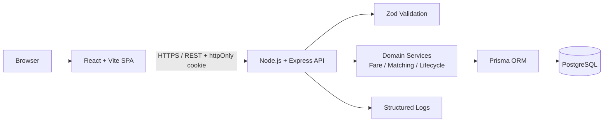
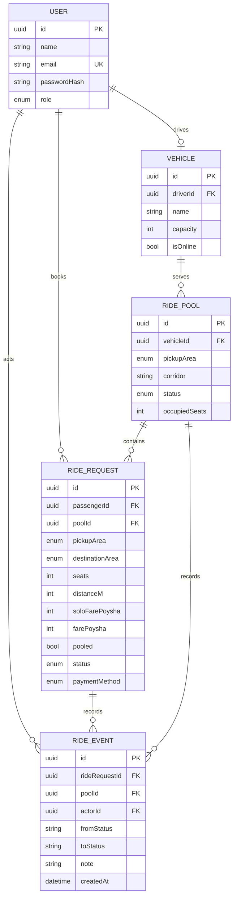

# Dhaka Tesla Pool 🚕⚡

> **Share a seat. Split the fare. Survive Dhaka traffic.**

A production-minded ride-pooling MVP built for the RoBenDevs Software Engineer Internship challenge.

## Live Demo

- **Frontend:** https://web-sigma-gold-52.vercel.app/login
- **Video Walkthrough:** ADD_VIDEO_URL_HERE
- **Release shown in demo:** `release/v1.0.0`

> Replace `ADD_VIDEO_URL_HERE` after you upload your final walkthrough video.

---

## 1. Project Summary

Dhaka Tesla Pool is a simple ride-pooling application designed around a fictional three-seat electric vehicle named **Bullet**, driven by **Jashim**.

The demo passengers are:

- **Nusrat** — Banani → Mohakhali
- **Rafiq** — Banani → Gulshan 1
- **Shirin** — used for the final-seat / capacity edge case

The main engineering problem is not real-world routing. The project focuses on:

- passenger and driver authentication
- ride requests
- compatible ride pooling
- per-passenger fare privacy
- vehicle capacity enforcement
- ride lifecycle management
- concurrency safety
- ride history and audit events
- Docker reproducibility
- testing and deployment

The demo cast is intentionally kept consistent across seed data, documentation, and the product walkthrough.

---

## 2. Problem Statement

Nusrat wants to travel from Banani to Mohakhali. Rafiq wants to travel from Banani to Gulshan 1. Since both passengers start from Banani and their destinations belong to a compatible route corridor, they may share the same vehicle.

Jashim drives **Bullet**, which has a fixed capacity of **3 seats**.

The system must ensure that:

- passengers can request rides using pickup, destination, and seat count
- compatible requests may share the same Tesla
- occupied seats never exceed vehicle capacity
- each passenger sees only their own fare and status
- the driver sees assigned passengers, seat usage, and ride stage
- completed and cancelled rides remain traceable in history

---

## 3. Core Features

### Passenger

- Sign up / sign in
- Request a ride
- Select pickup and destination
- Select number of seats
- View estimated fare
- Track ride status
- View personal ride history
- Cancel a ride while cancellation is still valid
- See only their own fare and ride data

### Driver

- Sign in
- Go online / offline
- View Bullet and its fixed seat capacity
- View relevant passenger requests
- Accept a ride / pool
- See passengers and seat usage
- Mark driver arrival
- Start trip
- Complete trip
- View ride history

### Pooling

- Multiple compatible requests may share one vehicle
- Same pickup area is required
- Destination must belong to the same configured route corridor
- Vehicle must be online
- Enough seats must be available
- Capacity must never be exceeded

---

## 4. Ride Lifecycle

```text
REQUESTED
   ↓
MATCHED
   ↓
ACCEPTED
   ↓
DRIVER_ARRIVED
   ↓
STARTED
   ↓
COMPLETED
```

Cancellation is supported while the ride is still in a valid cancellable state.

Invalid state transitions are rejected by the domain layer.

---

## 5. Technology Stack

### Frontend

- React
- Vite
- TypeScript

### Backend

- Node.js
- Express
- TypeScript
- REST API

### Database

- PostgreSQL
- Prisma ORM

### Validation / Auth

- Zod validation
- JWT authentication
- httpOnly cookies

### Testing

- Vitest
- Integration tests
- Concurrency test for final-seat protection

### DevOps

- Docker
- Docker Compose
- GitHub Actions CI
- Render / Vercel deployment

---

## 6. Architecture



### Why this architecture?

The project uses a small monolithic architecture because the challenge is a single ride-pooling MVP.

A single API and relational database make it easier to:

- enforce capacity rules
- validate lifecycle transitions
- keep transactions consistent
- test business logic
- explain the system clearly

Microservices, queues, Redis, and event buses were intentionally not added because they are unnecessary for the MVP.

---

## 7. Entity Relationship Diagram



### Entity Summary

- **USER** — stores passenger and driver accounts
- **VEHICLE** — stores driver vehicle information and capacity
- **RIDE_POOL** — stores the shared ride and occupied seats
- **RIDE_REQUEST** — stores each passenger's request, route, fare, and status
- **RIDE_EVENT** — stores lifecycle and audit history

---

## 8. Matching Rule

The MVP does not implement full routing or Google Maps.

A passenger request may join an existing open pool when:

1. pickup area is the same
2. destination belongs to the same predefined corridor
3. the vehicle is online
4. enough seats are available

### Example

```text
Nusrat: Banani → Mohakhali
Rafiq:  Banani → Gulshan 1
```

Both destinations belong to the same configured **NORTH_CENTRAL** corridor, so they can share the same pool when capacity is available.

---

## 9. Fare Model

Money is stored as **integer poysha** instead of floating-point values to avoid rounding errors.

```text
soloFare = baseFare + distanceCharge

pooledFare = soloFare - 15% poolDiscount

baseFare = ৳50
distanceCharge = ৳15/km
```

### Example

#### Nusrat

```text
Banani → Mohakhali
Distance = 3.0 km

Solo Fare:
৳50 + (3.0 × ৳15)
= ৳95.00

Pooled Fare:
৳95.00 - 15%
= ৳80.75
```

#### Rafiq

```text
Banani → Gulshan 1
Distance = 2.4 km

Solo Fare:
৳50 + (2.4 × ৳15)
= ৳86.00

Pooled Fare:
৳86.00 - 15%
= ৳73.10
```

Each passenger keeps an individual fare.

---

## 10. Capacity and Concurrency

The important edge case is:

> Bullet has one seat left and two passengers try to claim it at nearly the same time.

The MVP protects this using:

- PostgreSQL as the source of truth
- Prisma serializable transactions
- retry on serialization / unique conflicts
- transactional `occupiedSeats` updates
- database constraints
- a concurrency integration test

The system is designed so that two concurrent requests cannot both claim the same final seat.

---

## 11. Demo Credentials

| Role | Name | Email | Password |
|---|---|---|---|
| Driver | Jashim | `jashim@demo.local` | `Driver123!` |
| Passenger | Nusrat | `nusrat@demo.local` | `Pass123!` |
| Passenger | Rafiq | `rafiq@demo.local` | `Pass123!` |
| Passenger | Shirin | `shirin@demo.local` | `Pass123!` |

> These are seed-only demo credentials for the internship evaluation.

---

## 12. API Overview

| Method | Endpoint | Purpose |
|---|---|---|
| POST | `/api/auth/register` | Passenger sign-up |
| POST | `/api/auth/login` | Sign in |
| POST | `/api/auth/logout` | Sign out |
| GET | `/api/auth/me` | Get current user |
| GET | `/api/meta/areas` | Get predefined Dhaka areas |
| POST | `/api/rides/estimate` | Calculate passenger fare estimate |
| POST | `/api/rides` | Create a ride request |
| GET | `/api/rides/me` | Passenger rides / history |
| GET | `/api/rides/:id` | View own ride details |
| POST | `/api/rides/:id/cancel` | Cancel own ride while valid |
| GET | `/api/driver/dashboard` | Driver dashboard |
| PATCH | `/api/driver/vehicle/online` | Toggle online / offline |
| POST | `/api/driver/pools/:id/transition` | Accept / arrive / start / complete |
| POST | `/api/driver/requests/:id/accept` | Accept waiting request into a new pool |
| GET | `/health` | API health check |

---

## 13. Project Structure

```text
.
├── apps
│   ├── api
│   │   ├── prisma
│   │   │   ├── migrations
│   │   │   └── schema.prisma
│   │   └── src
│   │       ├── domain
│   │       ├── middleware
│   │       ├── routes
│   │       ├── services
│   │       ├── tests
│   │       ├── app.ts
│   │       ├── server.ts
│   │       └── seed.ts
│   │
│   └── web
│       └── src
│           ├── components
│           ├── lib
│           └── pages
│
├── docs
│   ├── assumptions.md
│   ├── deployment.md
│   ├── git-plan.md
│   ├── interview-notes.md
│   ├── requirement-traceability.md
│   └── video-script.md
│
├── .github
├── docker-compose.yml
├── package.json
└── README.md
```

---

## 14. Local Setup

### Prerequisites

Install:

- Node.js
- npm
- Docker Desktop
- Git

Clone the repository:

```bash
git clone https://github.com/shahipervez/dhaka-tesla-pool.git
cd dhaka-tesla-pool
```

Install dependencies:

```bash
npm install
```

Create environment files from the provided examples:

```bash
cp .env.example .env
```

Run the API:

```bash
npm run dev:api
```

Run the frontend in another terminal:

```bash
npm run dev:web
```

---

## 15. Docker Setup

The project is designed to run with Docker Compose.

```bash
docker compose up --build
```

This starts:

- frontend
- backend API
- PostgreSQL database

The repository also includes:

- `.env.example`
- database migration support
- seed data
- health checks

---

## 16. Database Migration and Seed

Generate Prisma client:

```bash
npx prisma generate --schema apps/api/prisma/schema.prisma
```

Apply database schema / migrations according to the configured environment:

```bash
npx prisma migrate deploy --schema apps/api/prisma/schema.prisma
```

Seed demo data:

```bash
npx tsx apps/api/src/seed.ts
```

Seed users include:

- Jashim
- Nusrat
- Rafiq
- Shirin
- Bullet

---

## 17. Testing

Run tests:

```bash
npm test
```

Important behaviors covered:

- Bullet capacity cannot be exceeded
- invalid state transitions are rejected
- Nusrat and Rafiq fares are deterministic
- users cannot modify another user's ride
- cancellation after `STARTED` is rejected
- concurrent requests cannot corrupt seat capacity

To run the PostgreSQL concurrency test:

```bash
RUN_DB_TESTS=1 DATABASE_URL="postgresql://..." npm test
```

---

## 18. Git Workflow

The challenge requires meaningful Git history.

Long-lived branches:

```text
master
pre-release
release/v1.0.0
```

Feature branch examples:

```text
feature/passenger-auth
feature/fare-and-geography
feature/tesla-pooling
feature/driver-flow
feature/frontend
feature/testing-docs
```

Recommended commit style:

```text
feat(auth): add passenger login endpoint
feat(pool): enforce Bullet seat capacity
fix(pool): prevent overbooking available seats
build(docker): add compose setup for api and postgres
docs(readme): document deployment and demo flow
```

---

## 19. Deployment

The challenge requires free / free-tier deployment only.

### Current frontend

```text
https://web-sigma-gold-52.vercel.app/login
```

### Health Check

When the production API is available:

```text
GET /health
```

> If the backend deployment URL changes, update this section with the final production API URL before submission.

---

## 20. Known MVP Limitations

This project intentionally keeps the scope small.

Current limitations include:

- no real Google Maps routing
- no GPS tracking
- no real payment gateway
- simplified route-corridor matching
- no WebSocket real-time tracking
- no large-scale distributed matching engine
- no production notification service

These were deliberate trade-offs to keep the MVP focused on correctness and explainability.

---

## 21. Future Improvements

If the system grows, possible improvements include:

- real geospatial route matching
- live GPS tracking
- WebSocket real-time status updates
- caching
- rate limiting
- idempotency keys
- queues / event-driven processing
- read replicas
- stronger observability
- distributed ride matching
- production payment integration
- mobile applications

---

## 22. Scaling to 1M Passengers / 100K Drivers

At larger scale, I would consider:

- horizontal API scaling
- load balancing
- database indexing
- read replicas
- Redis caching
- geospatial indexes
- event queues
- real-time communication
- rate limiting
- idempotent commands
- retry / failure handling
- monitoring and observability
- partitioning ride-matching workloads

These are intentionally not included in the MVP because the current system does not yet require that complexity.

---

## 23. AI Usage

AI tools were used as normal engineering support during this project.

### Tools used

- ChatGPT
- documentation
- code assistance tools

### AI was used for

- discussing architecture
- reviewing implementation ideas
- debugging
- deployment troubleshooting
- documentation improvement
- explaining trade-offs

### Example accepted suggestion

Using predefined route corridors instead of building a complete real-time map-routing system was accepted because it keeps the project focused on the actual pooling and capacity problem.

### Example changed / rejected suggestion

Unnecessary infrastructure such as microservices, Redis, queues, or Kubernetes was not added because it would increase complexity without solving an MVP requirement.

All implementation choices remain the responsibility of the author, and the code is expected to be explainable and modifiable during review.

---

## 24. Six-Minute Video Walkthrough

The final walkthrough should stay under six minutes.

### 0:00-1:00

Explain:

- problem
- users
- core idea

### 1:00-3:00

Explain:

- architecture
- backend
- frontend
- database
- ERD
- ride lifecycle
- matching rule
- fare model
- one key decision
- one trade-off

### 3:00-6:00

Demonstrate:

1. Nusrat requests Banani → Mohakhali
2. Rafiq requests Banani → Gulshan 1
3. Show shared pooling
4. Jashim goes online
5. Driver accepts the pool
6. Mark arrived
7. Start trip
8. Complete trip
9. Show passenger fare and history
10. Explain Shirin / last-seat capacity edge case

Video URL:

```text
ADD_VIDEO_URL_HERE
```

---

## 25. Requirement Traceability

Important requirements are mapped to implementation files in:

```text
docs/requirement-traceability.md
```

Examples:

- authentication → `apps/api/src/routes/auth.ts`
- fare logic → `apps/api/src/domain/fare.ts`
- matching → `apps/api/src/domain/geography.ts`
- lifecycle → `apps/api/src/domain/lifecycle.ts`
- pooling → `apps/api/src/services/pool.ts`
- driver flow → `apps/api/src/services/driver.ts`
- ride history / cancellation → `apps/api/src/services/ride.ts`
- tests → `apps/api/src/tests/`

---

## 26. Submission Checklist

Before final submission:

- [ ] GitHub repository is public and evaluator-accessible
- [ ] frontend and backend are both publicly accessible
- [ ] final deployment URLs are added to this README
- [ ] `release/v1.0.0` branch exists
- [ ] `master` and `pre-release` branches exist
- [ ] Docker Compose works from a clean environment
- [ ] migrations and seed run successfully
- [ ] test suite passes
- [ ] screenshots / GIFs are updated
- [ ] six-minute walkthrough is uploaded
- [ ] video URL is added to README
- [ ] AI Usage section is present
- [ ] no `.env`, tokens, API keys, or secrets are committed

---

## 27. Author

**Shahi Pervez Pulok**

Software Engineering / AI / Data Science enthusiast

GitHub: https://github.com/shahipervez

---

## Final Note

Dhaka Tesla Pool is intentionally small enough to understand, test, debug, and explain live.

The goal is not to imitate a full ride-sharing platform. The goal is to demonstrate sound engineering decisions around:

**Understand → Design → Build → Commit → Test → Ship → Explain → Debug → Change**
